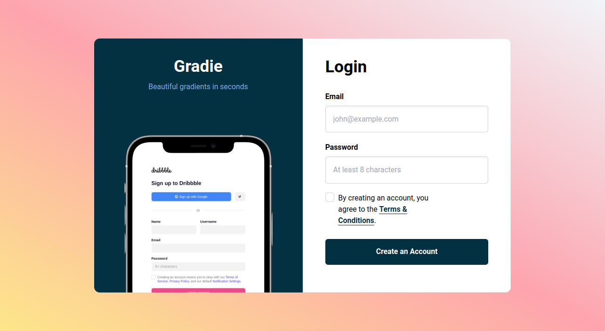

# Gradie: Beautiful Gradients in Seconds

Gradie is a simple and elegant login page template that allows users to create an account with ease. The project features a visually appealing design with a focus on gradients, providing users with a seamless experience.

## Features

- **Gradient Background:** Enjoy a visually stunning login page with a gradient background that transitions from amber to rose and ends in slate tones.
- **Responsive Design:** The layout is designed to be responsive, ensuring a consistent and engaging user experience across various devices.
- **Secure Login:** The login form includes fields for email and password, ensuring a secure and straightforward login process.
- **Terms & Conditions:** Users are prompted to agree to the terms and conditions before creating an account, with a convenient link for more information.

## Usage

1. Clone the repository.
2. Install dependencies using `npm install`.
3. Run the application with `npm start`.

Feel free to customize the template to suit your project's needs. Create an account with Gradie, and start building your own beautiful login pages!
